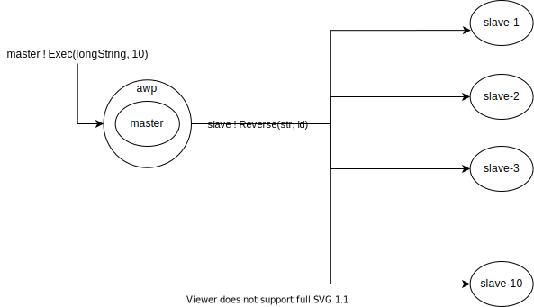
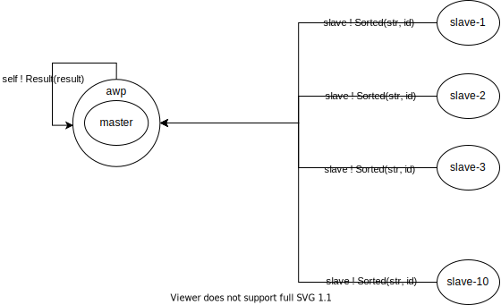
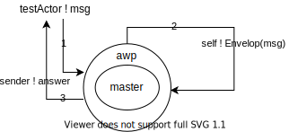

# Akka-awp 
A lightweight testing library which goal is to make integration tests on complex actors application easier.

# Installation
The artifacts are published to Maven Central.

```scala
libraryDependencies +=
  "net.rollercoders.akka" %% "akka-awp-testkit" % "1.0.0"
```
## Table of contents
- [Abstract](#abstract)
- [Examples](#examples)
    * [Distributed reverse string (high-level API)](#distributed-reverse-string)
    * [Silly Actor (low-level API)](#silly-actor)
- [Getting started](#getting-started)
    * [Create an ActorWithProbe instance](#create-an-actorwithprobe-instance)
    * [Testing an ActorWithProbe mailbox](#testing-an-actorwithprobe-mailbox)
- [FAQ](#faq)

## Abstract
Akka-awp helps in writing tests that check complex actor applications 
for correctness and regressions. The core idea was to write a library that could 
answer the following question: 
*How can I easily test my system just by checking the final result (aka message) of the computation?*     


In that scenario, I would like to do this:

<pre>
awp ! DoSomething <b>thenWaitFor</b> awp <b>receiving</b> Output
</pre>

In other words:

```
Send to awp a DoSomething message, let all the actors execute their logic and then check that awp got an Output message
```

Here the tested awp is also the one that got the first message. 
This is just the simplest use case, not the only scenario covered. Let's dive into the library.  
 
## Examples
The aim of this section is to give a quick overview of how it looks like an akka-awp test.
The first example has been written using the low-level API while the second one has been written
using the high-level API. Both examples could be re-written using the other approach. 

Check [here][akka-awp-tests] the source code of all the examples.

### Distributed reverse string 
#### (low-level API)
This example will show you how akka-awp allow testing a complex system. 
Check [here][akka-awp-distributed-reverse-actor] the source code of the DistributeRevereString actor.

Given a long string, the algorithm returns the reversed string:
* A master actor spawns N slaves. The number of slaves is set at creation time.
* The master receives the string to reverse. The parallelism to use is set
through the Exec message along with the string to reverse (a small string can be split into 5 slices while a longer one 
can be split into 20 slices).
* Using a [Round Robin][akka-round-robin] algorithm the master sends to each slave a slice of the whole
string. 



* Each slave reverses the received string and then answer the master.
* The master merge together all the slaves' responses sending to itself the final
result through a Result message.



Given that behavior, testing with the low-level API can be done as follows:

```scala
"Distribute Reverse String using routing pool" must {
    "answer with the reversed string" in {

      val distributedSorter =
        ActorWithProbe
          .actorOf(ref =>
            Props(new DistributeRevereStringWithRoundRobinActor(Pool(10)) {
              override implicit val awpSelf: ActorRef = ref
            }))
          .withName("sorter-1")
          .build()
  
      distributedSorter ! Exec(longString, 20)
      distributedSorter eventuallyReceiveMsg Exec(longString, 20)
      distributedSorter eventuallyReceiveMsg Result(expected)
    }
}
```
Check [here][akka-awp-distributed-reverse-actor-tests] the source code of this example,
could be useful to get all the side syntax you need e.g. the import statements.

### Silly Actor 
#### (high-level API)
This example will show you how the high-level API of akka-awp allow testing also
the mailbox of the original sender. The high-level API are built on top of the low-level 
API. Check [here][akka-awp-test-actors] the source code of the SillyActor.




The behavior of the SillyActor is the following:
1. The testActor, from the ImplicitSender trait, send a String message to the SillyActor.
2. The SillyActor send to itself the received String message wrapped into an Envelop case class.
3. The SillyActor, once received the Envelop, answer the original sender (aka the testActor) with a
pre-defined answer.

```scala
"An actor that send to itself a message" must {
    "be able to test if he received it" in {
     
      val sillyRef =
        ActorWithProbe
          .actorOf(
            ref =>
              Props(new SillyActor("Got the message") {
                override implicit val awpSelf: ActorRef = ref
              })
          )
          .withName("silly")
          .build()

      sillyRef ! "Hello akka-awp" thenWaitFor sillyRef receiving Envelop("Hello akka-awp") andThenWaitMeReceiving "Got the message"
    }
  }
```

Check [here][akka-awp-test-actors-test] the source code of this example,
could be useful to get all the side syntax you need e.g. the import statements.

## Getting Started
Akka-awp exposes some factory methods that make available create an **ActorWithProbe**
instance i.e. an Akka actor on which can be invoked every method of [akka-testkit][akka-testkit] 
(like is it a TestProbe) other than new test methods implemented by the library 
(the low-level and high-level API we have seen in the above [examples](#examples)).

In order to have a concrete example to reference, here below will be used the [SillyActor example](#silly-actor).

### Create an ActorWithProbe instance
Check [here][akka-awp-testkit-pakage] the source code of the testkit.

```scala
def actorOf(f: ActorRef => Props)(implicit system: ActorSystem): ActorWithProbeBuilder
def actorOf(props: Props)(implicit system: ActorSystem): ActorWithProbeBuilder
def actorOf(actorRef: ActorRef)(implicit system: ActorSystem): ActorWithProbeBuilder
```

These methods from the ActorWithProbe object are the entry point of the library and can be used to create an ActorWithProbe instance.
When you create an awp instance you are wrapping a real-actor with an awp-actor. Doing that makes available
for the awp-actor to save into its mailbox all the messages the real-actor received.
Having these messages into the awp-actor mailbox is mandatory to run all the test methods the library offers.

The first `actorOf` method of the ones listed above is probably the one you will use more often since is the only one that makes available testing
the *responses* the wrapped actor receive (e.g. sender() ! Response). Every user-defined 
actor we want to test for the "responses" must extend the AWP trait from `net.rollercoders.akka.awp.trait.AWP`:

```scala
trait AWP {
  this: Actor =>
  implicit val awpSelf: ActorRef
}
``` 

AWP trait force you to explicitly define an `implicit val actorRef: ActorRef` into your 
user-defined actor. Most of the times the concrete definition will be `implicit val awpSelf: ActorRef = self`,
since there is no need to change the usual behavior of Akka into the non-test code.
Done that, the `implicit val awpSelf` can be overwritten into test code as follows:

```scala
val sillyRef =
  ActorWithProbe
    .actorOf(
      ref =>
        Props(new SillyActor("Got the message") {
          override implicit val awpSelf: ActorRef = ref     // < - - - HERE
        })
    )
    .withName("silly")
    .build()
```

The anonymous class syntax allows us to overwrite the `implicit ActorRef` inherited by the AWP
trait and so manage which is the implicit actorRef used by the `!` method as implicit sender
into the test code: the value used must be `ref` i.e. the awp reference exposed by the library.
Doing that, every message send to the sillyActor (the real-actor) will be managed
first by its awp (we are populating the awp-actor mailbox).

### Testing an ActorWithProbe mailbox
 
Akka-awp makes available all the methods from the [akka-testkit][akka-testkit] library
but also it exposes some new methods to test actors (the low-level and high-level API we have seen in the above [examples](#examples)).
Those methods are built on top of akka-testkit and allow to easily test if an actor will receive a message before
a timeout expires. One of the goals of the high-level API is to expose a declarative programming approach.

```scala
// To test if the original sender receive some message
def thenWaitMeReceiving
def thenWaitMeReceivingType[T]

// To test if a specific awp receive some message
def thenWaitFor 
def thenWaitForAll
def receiving
def receivingType[T]
``` 

Let's use the SillyActor example to show how the syntax works. Go back to take
a look at the [diagram](#silly-actor) or check [here][akka-awp-test-actors] the
SillyActor source code to get clear about the actor behavior.
        
<div><pre>
<b>[1]</b>
<b></b>
<b>Query</b>  | SillyActor got the Envelop:
<b></b>       |
<b>Syntax</b> | sillyRef ! "Hello akka-awp" <b>thenWaitFor</b> sillyRef <b>receiving</b> Envelop("Hello akka-awp")
</pre></div>
        
<div><pre>
<b>[2]</b>
<b></b>
<b>Query</b>  | SillyActor got a message of type Envelop:
<b></b>       |
<b>Syntax</b> | sillyRef.!("Hello akka-awp").<b>thenWaitFor</b>(sillyRef).<b>receivingType</b>[Envelop]
</pre></div>

<div><pre>
<b>[3]</b>
<b></b>
<b>Query</b>  | testActor got the answer
<b></b>       |
<b>Syntax</b> | sillyRef ! "Hello akka-awp" <b>thenWaitMeReceiving</b> "Got the message"
</pre></div>

<div><pre>
<b>[4]</b>
<b></b>
<b>Query</b>  | testActor got a message of type String:
<b></b>       |
<b>Syntax</b> | sillyRef.!("Hello akka-awp").<b>andThenWaitMeReceivingType</b>[String]
</pre></div>

<div><pre>
<b>[5]</b>
<b></b>
<b>Query</b>  | SillyActor got the Envelop and testActor got the answer:
<b></b>       |
<b>Syntax</b> | sillyRef ! "Hello akka-awp" <b>thenWaitFor</b> sillyRef <b>receiving</b> Envelop("Hello akka-awp") <b>andThenWaitMeReceiving</b> "Got the message"
</pre></div>
         
<div><pre>
<b>[6]</b> 
<b></b> 
<b>Query</b>  | SillyActor got a message of type Envelop and testActor got a message of type String:
<b></b>       |
<b>Syntax</b> | sillyRef.!("Hello akka-awp").<b>thenWaitFor</b>(sillyRef).<b>receivingType</b>[Envelop].<b>andThenWaitMeReceivingType</b>[String]
</pre></div>           
        
**SillyActor got the Envelop (akka-awp low-level API)**

```scala
// [1]

sillyRef ! "Hello akka-awp"
sillyRef eventuallyReceiveMsg Envelop("Hello akka-awp")
```

**SillyActor got the Envelop (akka-testkit)**

```scala
// [1]

sillyRef ! "Hello akka-awp"
sillyRef expectMsg "Hello akka-awp"
sillyRef expectMsg Envelop("Hello akka-awp")
```


## FAQ

### How is possible invoke test method on real-actor ?
Akka-awp is able to invoke test methods on real-actors because it handles
under the hood a hidden TestProbe that receives all the messages the
actor gets.

### It is a good practice to test auto-messages (e.g. self ! Msg) ?
No, it isn't. I wrote some examples that done that to show all the library features, but most of the
time you don't want to test auto-messages. Moreover, to test auto-messages you need to change the real-actor
source code using `awpSelf` instead of `self` (`awpSelf ! Msg`) otherwise the awp-actor won't get those messages into
its mailbox. 

*Hint* The auto-messages, like private methods in Object-oriented programming, 
should not be tested.


### Corner cases
In this section will be listed all the founded corner case.
* Even if you use `awpSelf` to intercept auto-messages, that won't make available to test messages that come
from [timers][akka-timers] (e.g. `timers.startTimerAtFixedRate(Key, Msg, 1 second)`. These
messages are sent using the `self` ActorRef that comes from the Actor trait.
  
  
# License
Akka-awp is Open Source and available under the Apache 2 License.

This code uses [Akka][akka] which is licensed under the Apache 2 License, and can be obtained [here][akka]


[akka]: https://github.com/akka/akka
[akka-round-robin]: https://doc.akka.io/docs/akka/current/routing.html
[akka-testkit]:https://doc.akka.io/docs/akka/current/testing.html
[akka-timers]: https://doc.akka.io/api/akka/current/akka/actor/Timers.html

[akka-awp-distributed-reverse-actor]: https://github.com/lucataglia/akka-awp/blob/main/akka-awp-examples/src/main/scala/examples/DistributeRevereStringActor.scala
[akka-awp-distributed-reverse-actor-tests]: https://github.com/lucataglia/akka-awp/blob/main/akka-awp-examples/src/test/scala/examples/DistributeRevereStringActorSpec.scala
[akka-awp-testkit-pakage]: https://github.com/lucataglia/akka-awp/blob/main/akka-awp-testkit/src/main/scala/net/rollercoders/akka/awp/testkit/package.scala
[akka-awp-tests]: https://github.com/lucataglia/akka-awp/tree/main/akka-awp-examples/src/test/scala/examples
[akka-awp-test-actors]: https://github.com/lucataglia/akka-awp/blob/main/akka-awp-examples/src/main/scala/examples/TestActors.scala
[akka-awp-test-actors-test]: https://github.com/lucataglia/akka-awp/blob/main/akka-awp-examples/src/test/scala/examples/TestActorSpec.scala
