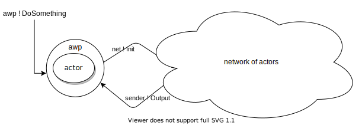

# Actor With Probe 
A lightweight testing library that works along with [akka-testkit][akka-testkit]
to makes integration tests on complex actors network easier.

## Main goal
Akka-awp can help in testing complex and less complex systems made by Akka actors. 
Create an actor using akka-awp API makes available invoking new test methods on the
ActorRef other than all the akka-testkit methods like it is a TestProbe. 

The goal is to help in writing smaller tests that check complex actor networks 
for correctness and regression. The test just need to making sure that given 
the initial message the wanted output is the one expected.     



In a scenario like the one above, the testing line will be:
```
actor eventuallyReceiveMsg Output
```
 
## Examples
To see more examples please take a look at the [test folder][akka-awp-tests].

[akka-testkit]:https://doc.akka.io/docs/akka/current/testing.html
[akka-awp-tests]: https://github.com/lucataglia/akka-awp/tree/main/src/test/scala/actorWithProbe